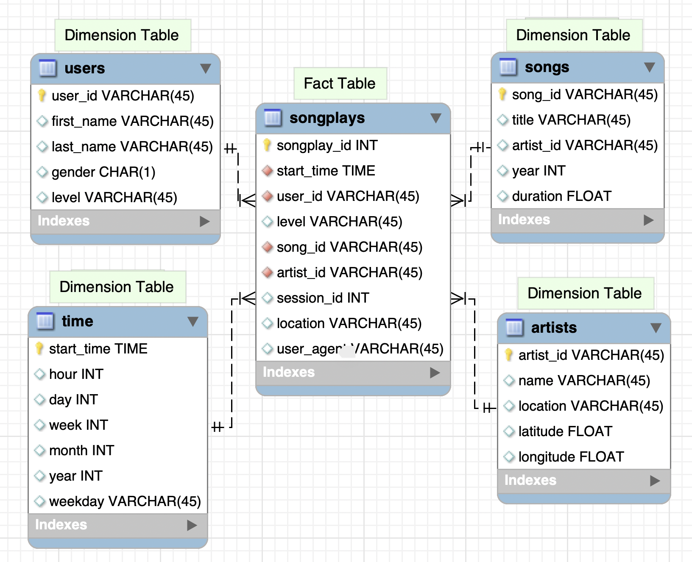

### AWS DATA Lake Project (AWS S3 Bucket - Spark - AWS S3 Bucket)

#### Introduction

In this project, I built an ETL pipeline for music streaming company named Sparkify to extract, transform and load data to a data lake. As we all know data lake is a centralized repository that allows you sotre all structured and unstructured data at any scale. Organizations that implements data lake successfully will generate great business value from their data to outperform their peers. In this project an ETL pipeline was set up to extract data from S3 and by using pySpark to process data and load data back into S3 as a set of dimensional tables in parquet format. Spark process was deployed on a cluster using AWS.

#### Data Source

Links to two dataset in S3

* Song data: s3://udacity-dend/song_data
* Log data: s3://udacity-dend/log_data

Two types of source data file for this project: 

* **Song** Dataset:  
    A subset of real data from the [Million Song Dataset](http://millionsongdataset.com/). Each file is in JSON format and contains metadata about a song and the artist of that song. The files are partitioned by the first three letters of each song's track ID. For example, here are filepaths to two files in this dataset.

        song_data/A/B/C/TRABCEI128F424C983.json
        song_data/A/A/B/TRAABJL12903CDCF1A.json

    Inside each JSON file, data has following structure: 
        
        {
          "num_songs": 1,
          "artist_id": "ARJIE2Y1187B994AB7",
          "artist_latitude": null,
          "artist_longitude": null,
          "artist_location": "",
          "artist_name": "Line Renaud",
          "song_id": "SOUPIRU12A6D4FA1E1",
          "title": "Der Kleine Dompfaff",
          "duration": 152.92036,
          "year": 0
        }
 

* **Log** Dataset:  
    For illustration purpose, the second dataset consists of log files in JSON format generated by this [event simulator](https://github.com/Interana/eventsim) based on the songs in the dataset above. These simulate app activity logs from an imaginary music streaming app based on configuration settings.

    Fore each log data file path, it was partitioned by year, month, date like following:

        log_data/2018/11/2018-11-12-events.json
        log_data/2018/11/2018-11-13-events.json

    Example of data format for each log file: 
    JSON view:
    
        {
            "artist": null,
            "auth": "Logged In",
            "firstName": "Walter",
            "gender": "M",
            "itemInSession": 0,
            "lastName": "Frye",
            "length": null,
            "level": "free",
            "location": "San Francisco-Oakland-Hayward, CA",
            "method": "GET",
            "page": "Home",
            "registration": 1540919166796.0,
            "sessionId": 38,
            "song": null,
            "status": 200,
            "ts": 1541105830796,
            "userAgent": "\"Mozilla/5.0 (Macintosh; Intel Mac OS X 10_9_4) AppleWebKit/537.36 (KHTML, like Gecko) Chrome/36.0.1985.143 Safari/537.36\"",
            "userId": "39"
        }
       

#### Data Lake Schema 

Data extract from above sources will be distributed into 5 tables:

 

#### Setup and file description
* Install pySpark
* Download and install [java](http://www.java.com) 
* Set up AWS Spark cluster
    1. Create [IAM role](https://console.aws.amazon.com/iam/home#/roles) for using redshift service and attach policy to get S3 read only permission. 
    1. Create [EMR cluster](https://docs.aws.amazon.com/emr/latest/ManagementGuide/emr-gs.html#emr-getting-started-plan-and-configure).
    1. Fill in real information in dwh.cfg file, here a template file is provided.

